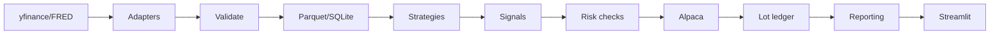

# Carmel

Carmel is an automated investing system for my own accounts. It pulls market data, runs ETF
momentum and dollar-cost-averaging strategies, checks every order against a risk layer, trades
through Alpaca (paper mode by default), and tracks tax lots for year-end reporting.

I built it with AI agents doing the coding. My part was the specs, the acceptance criteria, the
reviews, and the calls on what to build next. The repo keeps the evidence of that process
alongside the code.

## How it was built

Work moves in numbered tiers, more than 50 since March 2026. Each tier follows the same loop:

1. **Contract.** A planning agent writes a sprint contract: goal, scope, out-of-scope, test
   requirements, and the checks that decide pass or fail.
2. **Build.** A coding agent in Cursor implements it test-first (failing test, then code, then
   refactor), with ruff and the full suite green before it reports done.
3. **Review.** An evaluator agent grades the work against the contract and returns PASS or a list
   of required fixes. A tier closes only after the evaluator passes it.

Examples of contracts and their reviews are in [`docs/process/`](docs/process/). The rules every
agent works under (TDD, surgical edits, when to stop and ask, how to route open questions) are in
[`AGENTS.md`](AGENTS.md).

### The agent mailbox

Later tiers run through a file-based mailbox so the planning agent and the Cursor agent can pass
work back and forth without me copying prompts between them. A Cursor `stop` hook waits for the
next message and feeds it back in as the next turn. Every run is armed with a time limit and a
cycle limit, and a HALT file stops it at any point. The transport enforces closure: once a session
closes, the Cursor side is not handed new work even if a message is waiting. Details are in
[`.agents/mailbox/PROTOCOL.md`](.agents/mailbox/PROTOCOL.md).

### What is not in this repo

This is a public snapshot. My working notes (build state, open-questions log, research notebooks,
and account-specific runbooks) stay private, so a few references in `AGENTS.md` point to files
that are not here. Market data is not included either; the tests that need it skip.

## Size

| | |
| --- | --- |
| Source | about 23,000 lines of Python |
| Tests | about 27,000 lines, 1,148 passing |
| Risk layer | kill switch, PDT tracking, pre-trade checks, position sizing, portfolio limits |
| Reporting | FIFO tax lots, wash-sale detection across accounts, Form 8949 export, broker reconciliation |

## Features

- Three strategies: ETF momentum rotation, dollar-cost averaging, Bollinger/RSI mean reversion
- Eight technical indicators (SMA, EMA, RSI, ATR, Bollinger, MACD, ADX, Stochastic)
- ATR-based and fixed-weight position sizing
- Kill switch, position limits, PDT protection, pre-trade risk checks
- FIFO tax lot tracking, wash sale detection
- Backtesting with walk-forward and Monte Carlo validation
- Execution reconciliation against broker
- Equity curves, return metrics (Sharpe/Sortino/Calmar), Brinson attribution
- Webhook and email alerting
- Six-page Streamlit dashboard with Plotly charts
- Paper trading by default (safe mode)

## Quick start

### Path A: setup wizard (recommended)

```bash
git clone <repo-url> Carmel && cd Carmel
uv python install 3.12 && uv venv --python 3.12 && uv pip install -e ".[dev]"
carmel setup
```

### Path B: Docker

```bash
git clone <repo-url> Carmel && cd Carmel
cp .env.example .env  # edit with your Alpaca keys
docker compose up -d
# Dashboard at http://localhost:8501
```

## CLI reference

| Command | Description |
| --- | --- |
| `carmel setup` | Interactive first-time setup |
| `carmel config` | Print non-secret configuration |
| `carmel once` | Run one trading cycle |
| `carmel run` | Start the scheduler daemon |
| `carmel backtest` | Run a historical backtest |
| `carmel reconcile` | Compare local logs to broker |
| `carmel index-rag` | Rebuild doc RAG chunks in SQLite (Ollama embeddings) |
| `carmel ml-train` | Train experimental momentum classifier from Parquet (requires `.[ml]`) |

## LLM, RAG, and fundamentals (optional)

- **Ollama:** Install [Ollama](https://ollama.com/), run `ollama pull llama3.2` (or another model), set `llm.enabled: true` and `base_url` in `config/settings.yaml`.
- **Document RAG:** Set `rag.enabled: true` and whitelist `rag.index_paths` (under the repo root only). Run `carmel index-rag` with Ollama up; use `include_docs: true` on `POST /api/ai/ask` for doc-augmented answers. Prefer an embedding-capable model or set `rag.embedding_model`.
- **SEC fundamentals (Piotroski):** `uv pip install ".[fundamental]"` for `edgartools`. Set `fundamental.enabled: true` and optional `EDGAR_IDENTITY` in `.env` for SEC fair-access.

## Experimental ML overlay (optional)

Install extras: `uv pip install ".[ml]"` (scikit-learn, SHAP, etc.). Train from stored Parquet with `carmel ml-train --start YYYY-MM-DD --end YYYY-MM-DD`. Set `ml.enabled: true` in `config/settings.yaml` to log per-symbol scores (and optional SHAP text) into SQLite each cycle. With **`ml.affect_orders: true`**, signals below **`ml.score_threshold`** are dropped before orders (latest `ml_scores` batch in SQLite; **`ml.missing_score_action`** is `pass` or `block` when a symbol has no score). Default remains diagnostic-only (`affect_orders: false`). `GET /api/ml/latest` returns the latest batch (non-finite scores omitted); the Trade log dashboard shows the same data.

## Architecture



## Configuration

- **Non-secrets:** `config/settings.yaml` (strategies, risk, scheduler crons, notifications).
- **Secrets:** `.env` (Alpaca keys, FRED, SMTP). Copy from `.env.example`. Never commit `.env`.

## Testing

```bash
pytest tests/ -v --cov=src
ruff check src/ tests/
```

## Status

1,148 tests passing, ruff clean. Paper trading is the default mode.

## Tech stack

| Layer | Technology |
| --- | --- |
| Language | Python 3.12+ |
| Package manager | uv |
| Config | pydantic-settings + YAML + `.env` |
| Data | yfinance, FRED, Parquet, SQLite, DuckDB |
| Broker | Alpaca (alpaca-py) |
| Scheduling | APScheduler |
| Dashboard | Streamlit + Plotly |
| Lint / test | ruff, pytest |

## License

Personal project. Nothing here is financial advice.
